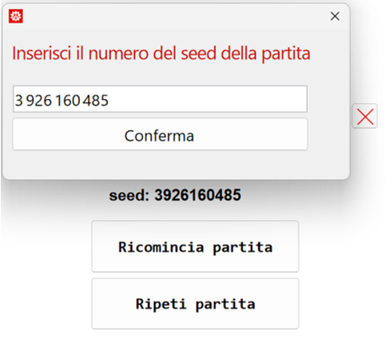
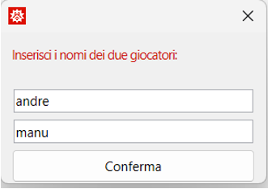
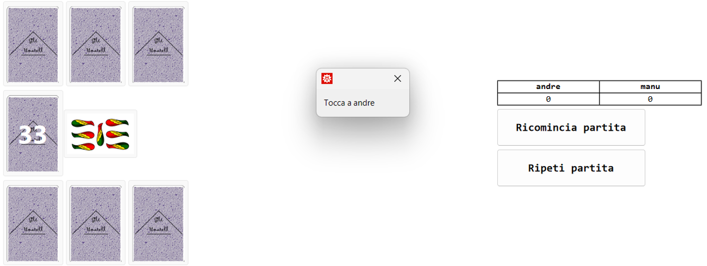
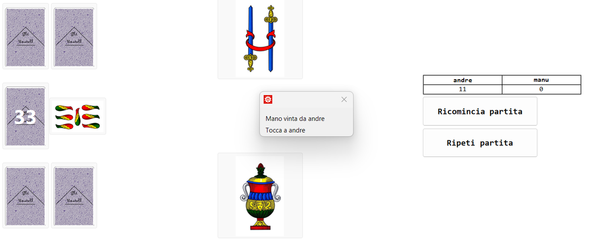
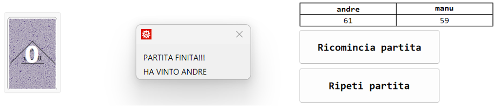

# BriscolaMath

Benvenuti nel progetto "Briscola Math Tutorial", una versione interattiva del classico gioco di carte italiano, la Briscola, sviluppata utilizzando Wolfram Mathematica. Questo progetto permette a due giocatori di sfidarsi in un ambiente virtuale con un'interfaccia grafica semplice e intuitiva.

## Introduzione

Il gioco della Briscola è un classico gioco di carte italiano che coinvolge due giocatori e un mazzo di 40 carte. L'obiettivo è accumulare il maggior numero possibile di punti vincendo le mani durante le varie fasi del gioco.

Questo progetto replica il gioco della Briscola in Mathematica, offrendo un'esperienza di gioco realistica e coinvolgente attraverso un'interfaccia grafica interattiva. I giocatori possono selezionare le loro mosse e valutare strategie per ottenere la vittoria.

	
Alcune immagini del gioco

	<table style="text-align: center;">
		<tr>
			<td>Scelta della partita</td>
			<td>Scelta dei nomi</td>
		</tr>
		<tr>
			<td>
				
			</td>
			<td>
				
			</td>
		</tr>
		<tr>
			<td>Tavolo da gioco</td>
			<td>Mano vinta</td>
		</tr>
		<tr>
			<td>
				
			</td>
			<td>
				
			</td>
		</tr>
		<tr>
			<td>Fine della partita</td>
		</tr>
		<tr>
			<td>
				
			</td>
		</tr>
	</table>

## Funzionalità Principali

- **Interfaccia Grafica**: Un'interfaccia intuitiva permette ai giocatori di interagire facilmente con il gioco.
- **Gestione del Seed**: Ogni partita utilizza un seed univoco per garantire una distribuzione delle carte riproducibile.
- **Ripetizione delle Partite**: Possibilità di rigiocare una partita passata utilizzando il seed corrispondente.
- **Esperienza di Gioco Realistica**: Le carte sono rappresentate graficamente e la logica di gioco segue le regole tradizionali della Briscola.

## Come Funziona il Gioco

### Avvio del Gioco

Per iniziare una nuova partita, segui questi passaggi:

1. Scarica il file `BriscolaMathTutorial.nb`.
2. Apri il file in Mathematica.
3. Seleziona "Evaluation" nella barra degli strumenti e clicca su "Evaluate Notebook".
4. Apparirà un bottone "Avvia Briscola". Cliccalo per iniziare a giocare.

### Regole del Gioco

Il gioco segue le regole tradizionali della Briscola, con l'obiettivo di accumulare più punti possibile vincendo le mani. All'avvio della partita, verranno richiesti i nomi dei giocatori e le carte saranno distribuite casualmente.

### Gestione delle Partite

I giocatori possono decidere di:

- **Ricominciare una nuova partita**: Resettando tutte le variabili, inclusa l'inizializzazione di un nuovo seed.
- **Ripetere una partita passata**: Inserendo il seed specifico per rigiocare con la stessa distribuzione di carte.

## Dettagli Tecnici

### Sistema di Estrazione delle Carte

Il progetto utilizza un sistema di estrazione basato su un seed per garantire che la distribuzione delle carte sia riproducibile e deterministica.

### Utilizzo del Seed

All'avvio di una nuova partita viene generato un seed univoco. Questo seed inizializza il generatore di numeri casuali, determinando la sequenza di estrazione delle carte. Inserendo un seed specifico, è possibile ripetere esattamente la stessa distribuzione di carte.

## Risorse Utilizzate

Le immagini delle carte sono state prelevate da internet e modificate per adattarsi all'interfaccia del gioco. Il retro delle carte è stato creato utilizzando strumenti grafici di Mathematica.
